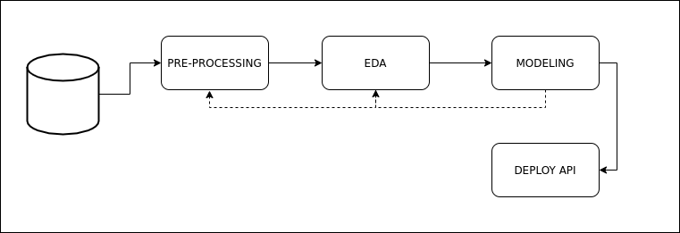
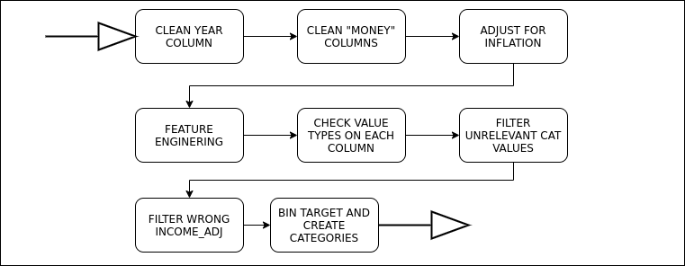
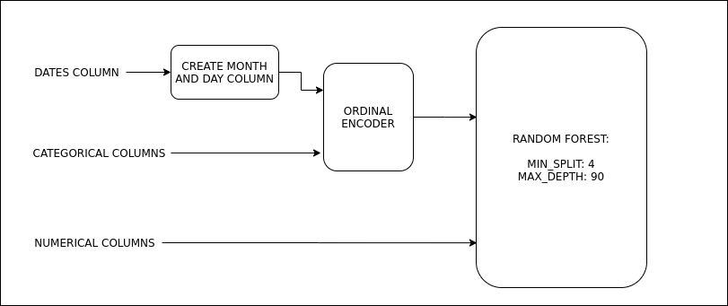
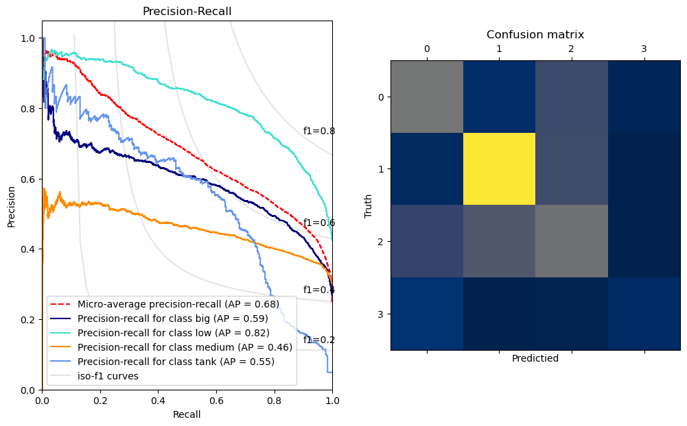

## Movie category Prediction

### With the growing amount of money invested in the film industry, and the paradigm shift in the way of consuming and producing films, is it possible to create a tool that serves as a guide to predict the income that a film will have?

#### General scheme of the project

#### The preprocessing is the result of the systematic iteration between the data exploration and the model. The final preprocessing is as follows

#### After trying different models, so far the most promising is RandomForest.

#### Main difficulties: 
- Number of categorical variables and their format "many to many".
- Low confidence in the accuracy of the target variable of the dataset.

#### How was it resolved:
- Find the values of the most influential categorical variables and transform the rest into "OTHER".
- Dividing the target variable into bins, allowing to reduce the influence of inaccuracies of the target variable.

#### The most promising thing that ended up not working:
Convert categorical variables to "longForm" format. Apparently it added more noise than anything else, confusing the models and getting worse results.

#### The results are far from conclusive, but they do serve as a kick to go deeper.

